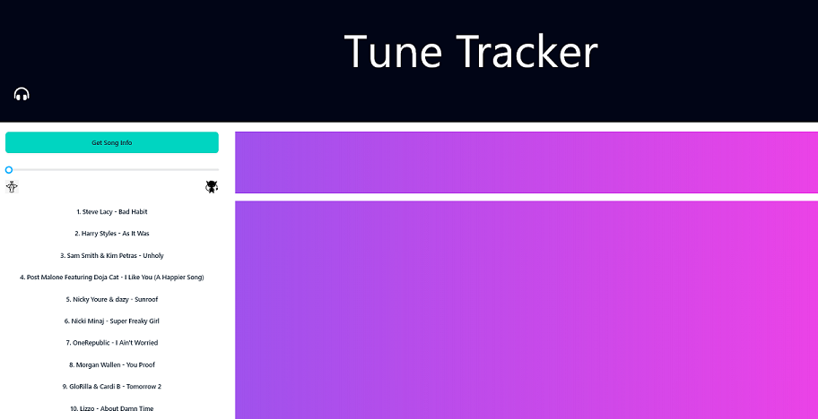
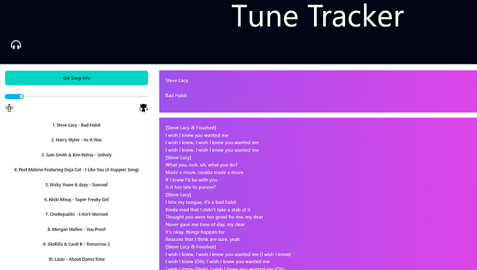
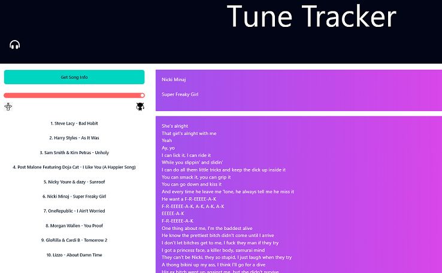
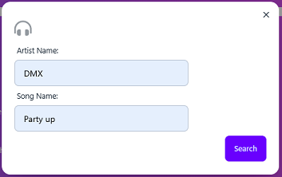

# Tune Tracker

## Description

With our website Tune Tracker, you can find song lyrics from your favorite artists , see the level of profanity in it with a displayed meter, and you can stay up-to-date with the latest Billboard chart rankings. It’s great if you’re a music lover, are curious about lyrics, or looking to avoid explicit content.

- As someone who appreciates music, I want a website that gives me a list of top x music so I can then select an artist and song to view the lyrics.
- As someone who appreciates music, I want a website that gives me the option to enter an artist and song so I can then view the lyrics.
- As someone who appreciates music, I want a graphic to display a meter showing profanity level of a selected artist’s song.

## Table of Contents

- [Technology](#technology)
- [General Functionality](#general-functionality)
- [Screenshots](#screen-shots)
- [Installation](#installation)
- [Usage](#usage)
- [Credits](#credits)
- [License](#license)

### Technology

This app will run in the browser and feature dynamically updated HTML powered by javascript and jQuery. Styling is managed with DaisyUI (tailwind css).

### General Functionality

#### Display Top 10 Billboard

When the page loads a listing of top 10 artists's songs are displayed on the screen.
Each artist's song is rendered as a button and can be clicked to view the lyrics for the
song and the profanity meter will adjust according to profanity found in the lyrics.

#### Search

A 'Get Song Info' button is available and when pressed, a modal window is opened where an Artist
and Song may be entered. Upon press of the search button, the lyrics will be retrieved from an API
and rendered to the screen. Additionally, the profanity meter is updated to reflect the profanity
found in the lyrics.

### Screen Shots

#### Page Initial Load

#### Select Top 10 Artist/Song (SFW)

#### Select Top 10 Artist/Song (NSFW)

#### Get Song Info Search

### Installation

You may clone the repository for access to the project files directly to copy/paste as needed. You may also fork the repository to utilize git actions to deploy as needed to support your workflows.

Since this is a static code project it may be deployed on any hosting platform supporting static code projects supporting html, css, and javascript including cloud providers:

- [AWS](https://aws.amazon.com/getting-started/hands-on/host-static-website/)
- [Azure](https://learn.microsoft.com/en-us/azure/static-web-apps/getting-started?tabs=vanilla-javascript)
- [Google Cloud](https://cloud.google.com/storage/docs/hosting-static-website)

Additionally, if your preference is more hands-on, you can deploy manually to:

- [IIS](https://learn.microsoft.com/en-us/iis/manage/creating-websites/scenario-build-a-static-website-on-iis)
- [Apache Tomcat](https://tomcat.apache.org/tomcat-9.0-doc/appdev/deployment.html)
- [Apache Http](https://fullstackdeveloper.guru/2021/04/08/how-to-deploy-html-javascript-code-to-apache-http-server/)

Or:

#### Run with Docker

- clone the repo `git clone https://github.com/the-great-code-calamity/tune_tracker.git`
- cd into the repo `cd tune_tracker`
- run `docker build -t tune:latest . && docker run -d -p 9001:80 --name tune tune`
  _note_: choose a port other than 9001 if you wish
- open your browser to `http://localhost:9001`

## Usage

This web project is currently deployed [on Github Pages](https://the-great-code-calamity.github.io/tune_tracker/)

## Credits

This was a collaborative effort of:

- Micah Cox - a.k.a. Kalink52
- Jorge Guzman - a.k.a JGuzman87
- Daniel Hudson - a.k.a TheLuckiestLlama
- Eric Roys - a.k.a ericroys / ericroys-school

## License

This project is licensed with the "Unlicense" license. [(Read more here)](LICENSE)

## How to Contribute

Thank you, but we are not seeking any contributions at this time unless you want to send $$,
which is always welcome.

## Tests

The project was unit tested while being developed. Automated testing will be added in future projects.
